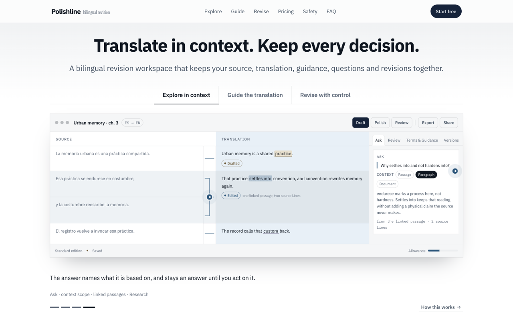

# Polishline — landing page

The marketing page for Polishline, a bilingual revision workspace for
translators. One self-contained `index.html`: every style, script and logo is
inline, and the only external request is Google Fonts.

**Live:** https://jan166.github.io/polishline/

## What is on the page

The hero carries three tabs — **Explore in context**, **Guide the translation**
and **Revise with control** — and each one names the product capabilities it
covers. Under them a mockup of the workspace plays a twelve-step demonstration
in three chapters, one per tab, so the product is doing something the moment
the page opens.

It runs on its own and yields the moment you touch it. Hovering holds it;
pressing a tab jumps to that chapter and keeps playing; the ticks move through
the four steps of the chapter on screen. A pulsing mark sits on the parts of
the workspace worth asking about — the centre gutter, the context row, a
terminology rule, a work marker, the suggestion actions, the revision trail —
and pressing one opens a short explanation of that region. **How this works**
opens a fuller per-chapter explanation mapping each region to the feature
behind it.

Below that: where the makers came from, the three capabilities at length,
safety, pricing, and the FAQ.

Product vocabulary on the page follows the product repository's vocabulary
owner — Ask, Suggestion, Terms & Guidance, Revisions, Saved version, Line,
linked passage, Allowance — so the page and the product say the same words.

## Editing the page

The page carries its own editor; no build step, no toolchain.

Open `index.html` from disk and an **Edit mode** button appears at the bottom
right. On the published site it stays hidden, so visitors only ever see the
landing page. `#edit` in the URL opens it either way, and `#clean` hides it
either way.

In edit mode you can:

- **reorder or hide any block** — drag in the layout panel, or use the arrows;
  each block also carries its own controls on the page
- **edit any wording in place** — click the text and type; Enter breaks a line
- **Save** — writes the file back in Chrome, or downloads it elsewhere
- **Copy** — puts the whole HTML on the clipboard
- **Revert** — returns to the state last saved to the file

Wording, block order and hidden blocks are stored as a patch in the page's
`pl-data` script. The authored markup in the `<template>` is never rewritten,
so saving repeatedly does not degrade the file, and an edit can always be
traced back to what it changed.

## Structure of `index.html`

| Part | What it holds |
|---|---|
| `<style id="pl-reset">` | A minimal reset, kept separate so an export can rebuild the head |
| `<style id="pl-css">` | Design tokens and every rule for the page, light and dark |
| `<script id="pl-data">` | The patch: wording overrides, block order, hidden blocks |
| `<template id="pl-body">` | The authored markup. Never edited by the page itself |
| `
` | Where the template is rendered, once, at load |
| `<script id="pl-js">` | Render, the demonstration, the hotspots, and the editor |

## Publishing

GitHub Pages serves `main` from the repository root. Push to `main` and the
site rebuilds; it usually takes a minute or two. `.nojekyll` keeps Pages from
running the file through Jekyll.

## Notes

- The page is English only.
- It follows the viewer's light or dark theme.
- Logos are inline SVG and follow the text colour, so they invert with the
  theme.
- `prefers-reduced-motion` stops the demonstration from advancing on its own
  and stills the hotspots; everything stays usable by hand.
